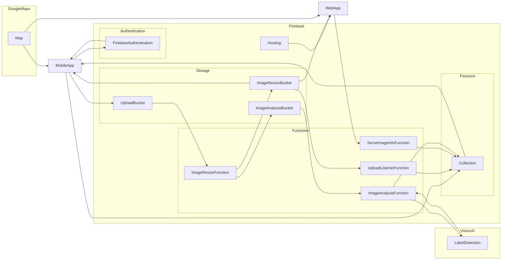

# Nature Photos App

# Architecture

```mermaid
graph LR

  MobileApp

  WebApp

  subgraph GoogleMaps
    Map
  end

  subgraph VisionAI
    LabelDetection
  end

  subgraph Firebase

    Hosting
    subgraph Storage
       UploadBucket 
       ImageResizeBucket
       ImageAnalysisBucket
    end
    subgraph Firestore
       Collection 
    end

    subgraph Functions
      ImageResizeFunction
      ImageAnalysisFunction
      UploadListenerFunction
      ServeImageInfoFunction
    end

    subgraph Authentication
      FirebaseAuthentication
    end
  end

  FirebaseAuthentication --> MobileApp
  Hosting --> WebApp
  MobileApp --> UploadBucket
  MobileApp --> Collection
  MobileApp --> FirebaseAuthentication 
  Collection --> MobileApp 
  UploadBucket --> ImageResizeFunction
  ImageResizeFunction --> ImageResizeBucket 
  ImageResizeFunction --> ImageAnalysisBucket
  ImageResizeBucket --> UploadListenerFunction
  ImageResizeBucket --> MobileApp
  ImageResizeBucket --> WebApp
  UploadListenerFunction --> Collection
  WebApp --> ServeImageInfoFunction
  ServeImageInfoFunction --> Collection
  ImageAnalysisBucket --> ImageAnalysisFunction
  ImageAnalysisFunction --> Collection 
  ImageAnalysisFunction --> LabelDetection
  LabelDetection --> ImageAnalysisFunction
  Map --> MobileApp
  Map --> WebApp
```

